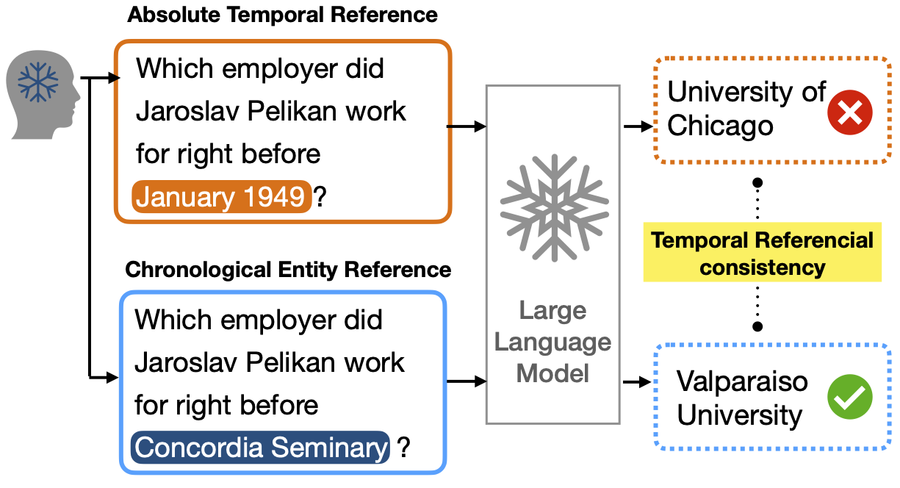

<h1 align="center">
<br>
[UnTRaP] Temporal Referential Consistency: Do LLMs Favor Sequences Over Absolute Time References?
</h1>


<p align="center">
  <a href="https://www.lcs2.in/"><b>[🌐 LCS2 Lab]</b></a> •
  <a href=""><b>[📜 Paper]</b></a> •
  <a href="https://github.com/ab-iitd/untrap/"><b>[🐱 GitHub]</b></a>
  
</p>


<p align="center">
Repo for "<a href="" target="_blank">Temporal Referential Consistency: Do LLMs Favor Sequences Over Absolute Time References?</a>"
</p>


## 🔥 News

- [2025/08/20] UnTRaP is accepted at EMNLP 2025 (main track)!


## 💡 Framework

<p align="center" width="100%">
    
</p>


## 💡 Abstract

<details close>
<summary> Abstract of UnTRaP</summary>

The increasing acceptance of large language models (LLMs) as an alternative to knowledge sources marks a significant paradigm shift across various domains, including time-sensitive fields such as law, healthcare, and finance. To fulfill this expanded role, LLMs must not only be factually accurate but also demonstrate consistency across temporal dimensions, necessitating robust temporal reasoning capabilities. Despite this critical requirement, efforts to ensure temporal consistency in LLMs remain scarce including noticeable absence of endeavors aimed at evaluating or augmenting LLMs across temporal references in time-sensitive inquiries. In this paper, we seek to address this gap by introducing a novel benchmark entitled temporal referential consistency, accompanied by a resource TEMP-ReCon designed to benchmark a wide range of both open-source and closed-source LLMs with various linguistic contexts characterized by differing resource richness (including English, French, and Romanian). The findings emphasis that LLMs do exhibit insufficient temporal referent consistency. To address this, we propose UnTRaP, a reasoning path alignment-based model that aims to enhance the temporal referential consistency of LLMs. Our empirical experiments substantiate the efficacy of UnTRaP compared to several baseline models.

</details>


## 🔧 Repo Structure
This repo contains the training scripts and path for TEMP-ReCon dataset. Detailed structure is as follow:
```
.
├── README.md
├── [Update Soon]
```
## TEMP-ReCon Resource
The TEMP-ReCon dataset is avaiable at HuggingFace. <a href="https://huggingface.co/datasets/ab-iitd/TEMP-ReCon"><b>[Click Here]</b></a>

## Citation
If you find it helpful, please kindly cite the paper.
```

